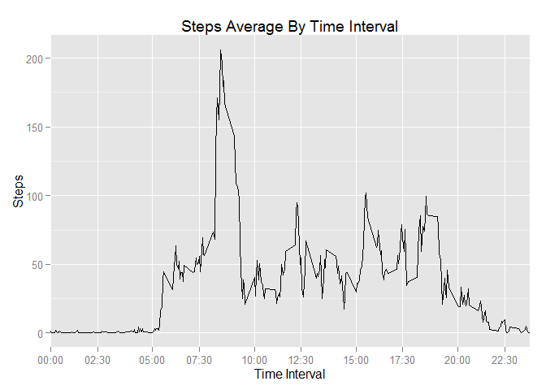

# Reproducible Research: Peer Assessment 1


##Loading and preprocessing the data
####1. Load the Data

```r
activity_data <- read.csv("activity.csv")
str(activity_data)
```

```
## 'data.frame':	17568 obs. of  3 variables:
##  $ steps   : int  NA NA NA NA NA NA NA NA NA NA ...
##  $ date    : Factor w/ 61 levels "2012-10-01","2012-10-02",..: 1 1 1 1 1 1 1 1 1 1 ...
##  $ interval: int  0 5 10 15 20 25 30 35 40 45 ...
```
Libraries will be used

```r
library(ggplot2)
library(dplyr)
```

```
## 
## Attaching package: 'dplyr'
## 
## The following objects are masked from 'package:stats':
## 
##     filter, lag
## 
## The following objects are masked from 'package:base':
## 
##     intersect, setdiff, setequal, union
```
##What is mean total number of steps taken per day?
####1. Calculate the total number of steps taken per day

```r
## sum steps each day
daily_steps <- aggregate( activity_data$steps,
                          by = list( activity_data$date ),
                          FUN = sum
                          )
#rename column with descriptive names
colnames(daily_steps) <- colnames(activity_data[2:1])
str(daily_steps)
```

```
## 'data.frame':	61 obs. of  2 variables:
##  $ date : Factor w/ 61 levels "2012-10-01","2012-10-02",..: 1 2 3 4 5 6 7 8 9 10 ...
##  $ steps: int  NA 126 11352 12116 13294 15420 11015 NA 12811 9900 ...
```

####2. Make a histogram of the total number of steps taken each day

```r
##plot steps histogram
g <- ggplot(daily_steps,aes(steps))
g + geom_histogram( binwidth = 61*10 ) +
        ggtitle("Density Daily Steps Average") +
        labs(x="Steps",y="Occurrence")
```

 


####3. Mean and median of the total number of steps taken per day
#####Calculation

```r
mean_daily_steps <- as.integer(mean( daily_steps$steps, na.rm=TRUE ))
median_daily_steps <- as.integer(median( daily_steps$steps, na.rm=TRUE))
```
#####Report

```r
mean_daily_steps
```

```
## [1] 10766
```

```r
median_daily_steps
```

```
## [1] 10765
```
The Mean of the total number of steps takes per day is 10766  
The Median of the total number of steps takes per day is 10765  

##What is the average daily activity pattern?  

####1.plot of the 5-minute interval and number of steps taken, across all days (y-axis)


```r
#Extract na's ocurrences
no_na_activity <- activity_data[!is.na(activity_data$steps),]
#Interval steps average
interval_steps_mean <- aggregate( no_na_activity$steps,
                by = list( no_na_activity$interval ),
                FUN = mean
                )
#rename column with descriptive names
colnames(interval_steps_mean) <- c("interval","mean_steps")
#Create the plot
f <- ggplot(interval_steps_mean,
            aes(interval,mean_steps))
f + geom_line() +
        ggtitle("Steps Average By Time Interval") +
        labs(x="Time Interval",y="Steps") +
        scale_x_discrete(
                breaks = c("0","230","500","730","1000","1230","1500","1730","2000","2230"),
                labels =  c("00:00","02:30","05:00","07:30","10:00","12:30","15:00","17:30","20:00","22:30")
                )
```

 

####2. Which 5-minute interval, contains the maximun number of steps?
#####Calculation

```r
max_steps <-max(interval_steps_mean$mean_steps) ##Max
where_max <- which.max(interval_steps_mean$mean_steps)##Max Index
max_step_interval <- interval_steps_mean[ where_max , ]##All values of the index inteval
```
#####Report

```r
max_steps
```

```
## [1] 206.1698
```

```r
date <- activity_data[where_max,2] ##day that max is register
date
```

```
## [1] 2012-10-01
## 61 Levels: 2012-10-01 2012-10-02 2012-10-03 2012-10-04 ... 2012-11-30
```
Interval 835  
The 2012-10-01  
Max mean steps 206.1698113  

## Imputing missing values
####1.the total number (of rows with) NAs

```r
na_vector <- is.na(activity_data$steps)
na_step <-sum( na_vector )
```
Report

```r
na_step
```

```
## [1] 2304
```
Number of NA's 2304

####2.Devise a strategy for filling in all of the missing values in the dataset
The data created 'interval_steps_mean' contain unique interval values with the mean of each.  
I merge it to the origin data 'activity_data' from the 'activity.csv'  
Then we assigne where the NA's index vector, created at the previus question, the value 
of the averages steps at the same interval.
At the end we just create our new data taken off the columns diferent from the original data.


####3.filling in the missing values: the mean for that 5-minute interval

```r
##see previus point to get explanation
temp_data <- left_join(activity_data,
                interval_steps_mean
               )
```

```
## Joining by: "interval"
```

```r
temp_data[na_vector,1] <- temp_data[na_vector,4]

new_activity_data <- temp_data[,1:3]
str(new_activity_data)
```

```
## 'data.frame':	17568 obs. of  3 variables:
##  $ steps   : num  1.717 0.3396 0.1321 0.1509 0.0755 ...
##  $ date    : Factor w/ 61 levels "2012-10-01","2012-10-02",..: 1 1 1 1 1 1 1 1 1 1 ...
##  $ interval: int  0 5 10 15 20 25 30 35 40 45 ...
```
####4.Histogram total steps each day

#####(being done the previuos step 3)


```r
## sum steps each day
daily_steps_2 <- aggregate(new_activity_data$steps,
                           by = list(new_activity_data$date),
                           FUN = sum)
##rename column with descriptive names
colnames(daily_steps_2) <- colnames(activity_data[2:1])
##plot steps histogram
h <- ggplot(daily_steps_2,aes(x = steps))
h + geom_histogram() +
        ggtitle("Density Daily Steps Average. After Extracting NA's Occurrences") +
        labs(x="Steps",y="Occurrence") 
```

```
## stat_bin: binwidth defaulted to range/30. Use 'binwidth = x' to adjust this.
```

 

####Calculate and report mean and median total number of steps taken per day


```r
## sum steps each day
daily_steps_2 <- aggregate(new_activity_data$steps,
                           by = list(new_activity_data$date),
                           FUN = sum)
##rename column with descriptive names
colnames(daily_steps_2) <- colnames(activity_data[2:1])

mean_daily_steps_2 <- mean( daily_steps_2$steps)
median_daily_steps_2 <- median( daily_steps_2$steps)
```
Report

```r
mean_daily_steps_2
```

```
## [1] 10766.19
```

```r
median_daily_steps_2
```

```
## [1] 10766.19
```
The Mean of the total number of steps takes per day is 1.0766189\times 10^{4}  
The Median of the total number of steps takes per day is 1.0766189\times 10^{4}  

####Do these values differ from the estimates from the first part of the assignment? 
The differences are minimal  

####What is the impact of imputing missing data on the estimates of the total daily number of steps?
While we are imputing the missing data with the average value, they make gross the ocurrences but of the averages values  

## Are there differences in activity patterns between weekdays and weekends?  
####1.new factor variable in the dataset. two levels - "weekday" and "weekend"

```r
date_format <-as.Date(new_activity_data$date)##transfor the dates from character to date class
day_date_format <- weekdays(date_format)##creating a vector of corresponding week day names
add_day <- cbind(new_activity_data,day_date_format)##merging both
day_name <- c("lunes","martes","miercoles","jueves","viernes","sábado","domingo")##in spanish because of my sistem interpretation
day_factor <- c("WEEKDAY","WEEKDAY","WEEKDAY","WEEKDAY","WEEKDAY","WEEKEND","WEEKEND")## create a weekday and weekend factor names
factor_data <- data.frame(day_name,day_factor)
colnames(factor_data)[1] <- colnames(add_day)[4]##rename column with descriptive names
final_data<- left_join(add_day,
               factor_data)##the data with type of week day factor included
```

```
## Joining by: "day_date_format"
```

```
## Warning in left_join_impl(x, y, by$x, by$y): joining factors with different
## levels, coercing to character vector
```

```r
str(final_data$day_factor)
```

```
##  Factor w/ 2 levels "WEEKDAY","WEEKEND": 1 1 1 1 1 1 1 1 1 1 ...
```
####2. plot containing 5-minute interval (x-axis) and the average number of steps taken, averaged across all weekday days or weekend days (y-axis)


```r
##sum steps each day of the week type
week_day_group<- aggregate( final_data$steps,
               by = list( final_data$interval,final_data$day_factor ),
               FUN = mean
               )
#rename column with descriptive names
colnames(week_day_group) <- colnames(final_data)[c(3,5,1)]
##plot both, the weekdays and weekends, number of steps by interval
q <- ggplot(week_day_group,aes(interval,steps))
q + geom_line() +
        facet_grid(day_factor~.) +
        ggtitle("Average Steps Each Interval At Weekday And Weekend")+
        labs(x="Time Interval",y="Steps") +
        scale_x_discrete(
                breaks = c("0","230","500","730","1000","1230","1500","1730","2000","2230"),
                labels = c("00:00","02:30","05:00","07:30","10:00","12:30","15:00","17:30","20:00","22:30")
        )   +
        stat_smooth(method = "loess",se=FALSE)
```

 
